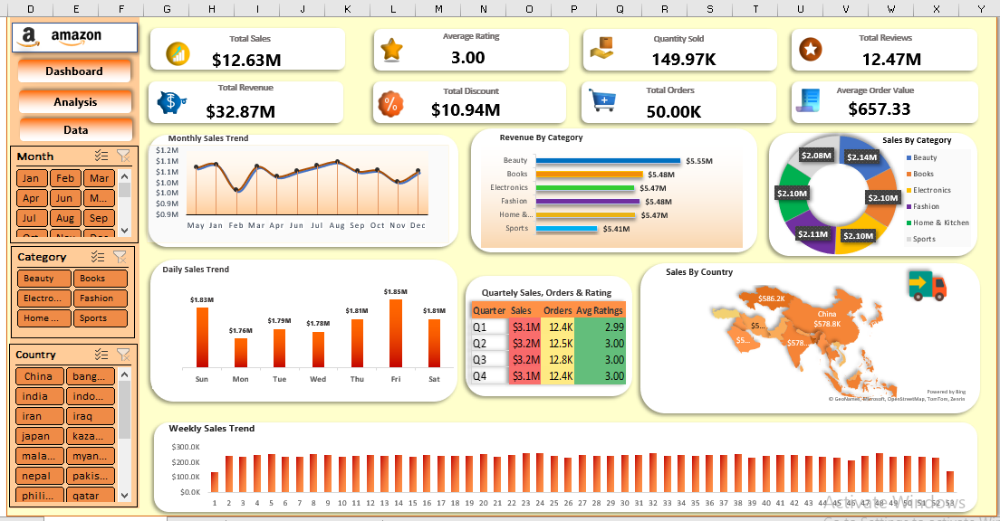

# Amazon-Sales-Dashboard
  

  

 

 

## 📊 Project Overview

Enterprise-grade Amazon Sales Analytics Dashboard designed for executive reporting, KPI monitoring, customer behavior analysis, category performance tracking, and strategic business decision-making.

## 📈 Key Metrics

- Revenue Analysis
- Sales Performance
- Order Monitoring
- Customer Ratings
- Review Analytics
- Country Analysis
- Category Analysis
- Quarterly Trends

## 🧹 Data Cleaning

- Missing Value Treatment
- Duplicate Removal
- Data Validation
- Outlier Detection
- Feature Engineering

## 🛠️ Tools

- Microsoft Excel
- Power Query
- Pivot Tables
- Dashboard Design
- Business Intelligence

## 🌐 Interactive Website

👉  https://iaaqib78.github.io/Amazon-Sales-Dashboard/
